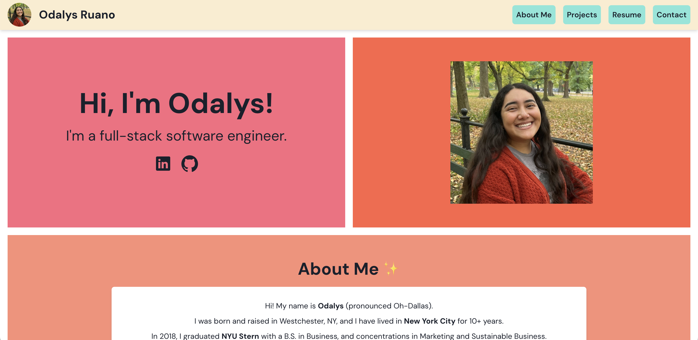
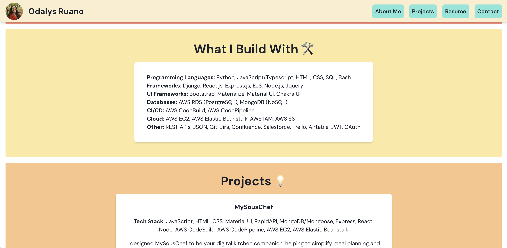
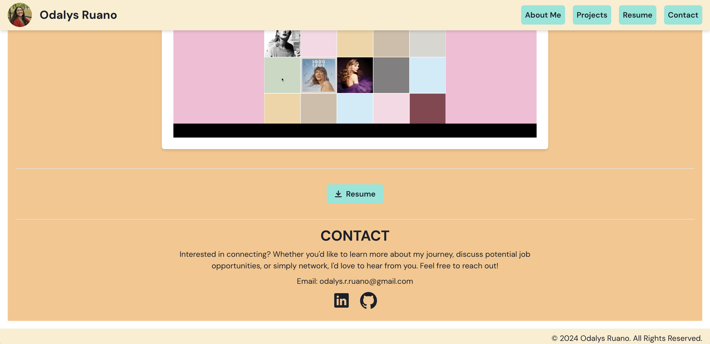
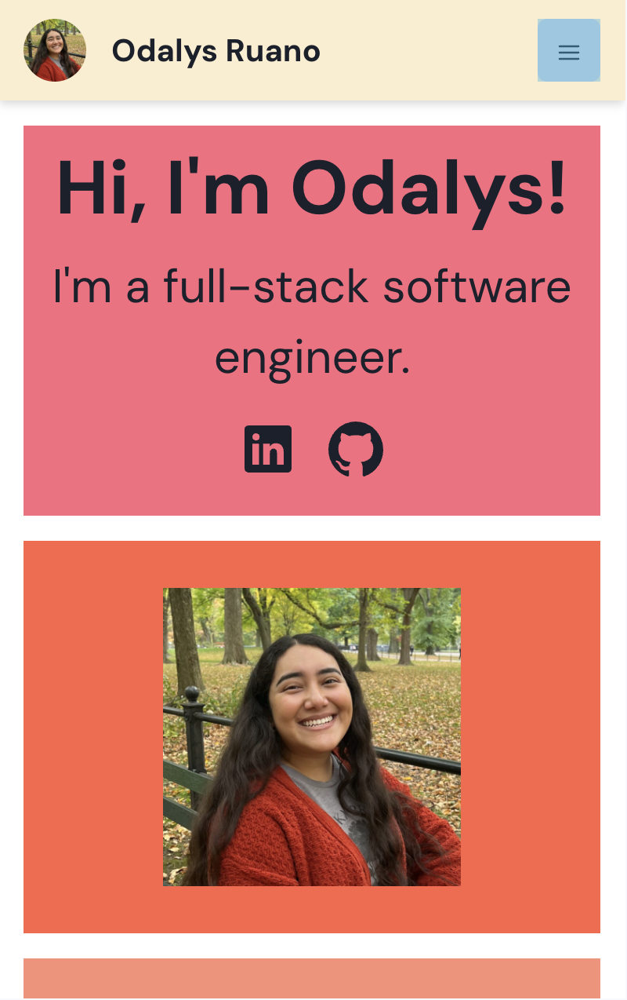
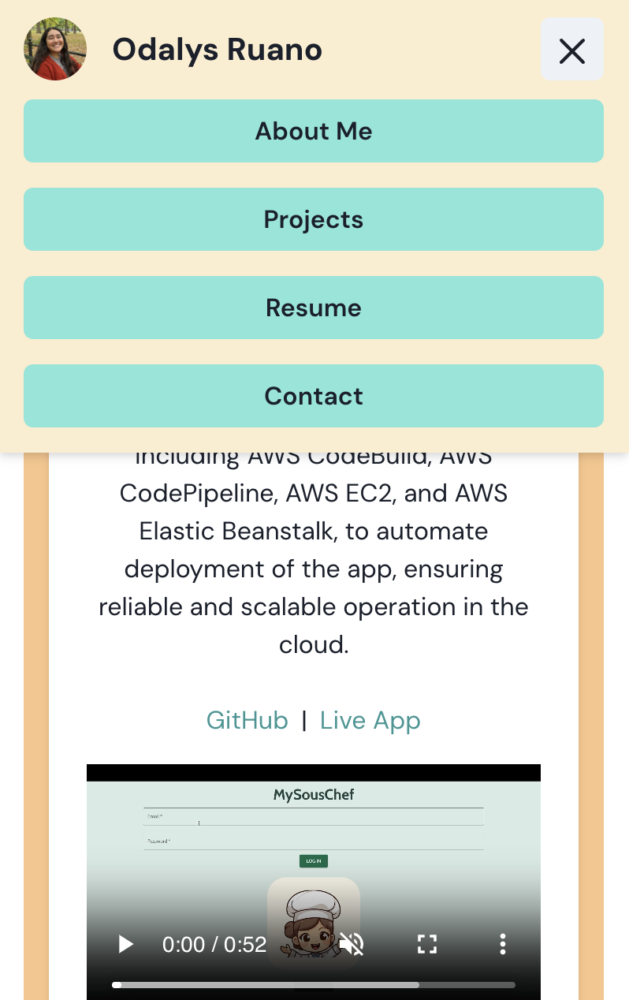

# My Personal Website
Link to App: http://odalysruano.com/

## App Description
OdalysRuano.com is a personal portfolio website I developed to showcase my career journey and experience as a full-stack software engineer. The main sections include "About Me", "Projects", "Resume", and "Contact". I utilized the Chakra UI framework, learning its comprehensive component library to design a modern, responsive interface. The entire site is built using TypeScript and React, allowing for strong type safety and scalable front-end development. The site is hosted using AWS services, with Route 53 managing domain routing, S3 providing static site hosting, and CodePipeline automating the deployment process.

## App Screenshots
Homepage:

What I Build With & Projects Sections:

Resume & Contact Sections:

Mobile View:

Mobile - Nav:

## Technologies Used
- Typescript
- React
- ChakraUI
- HTML
- CSS
- AWS Route 53
- AWS S3
- AWS CodePipeline
- AWS CloudFront
- AWS Certificate Manager

## Getting Started
Link to App: http://odalysruano.com/

## Next Steps
In addition to the website's current sections, I plan to expand the site by adding more personal pages, such as a reading list and a travel photography section, to reflect my broader interests.
